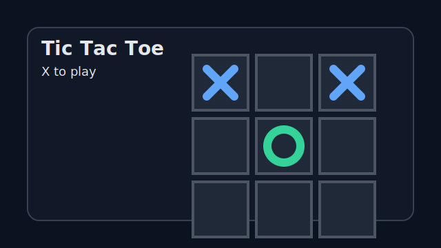

# food-share
A social media platform to share food and recipes

## Tic Tac Toe (frontend)

Run locally:

```bash
cd frontend
npm install
npm run dev
```

Build:

```bash
npm run build
```

Preview build:

```bash
npm run preview
```

Deploy (static hosting):
- Upload the `frontend/dist` folder to GitHub Pages/Netlify/Vercel.
- For GitHub Pages under a project site, ensure Vite base is configured if deploying to a subpath.

Live demo:
- Enable GitHub Pages, then the site will be published automatically by the provided workflow.

Screenshot:
- 

